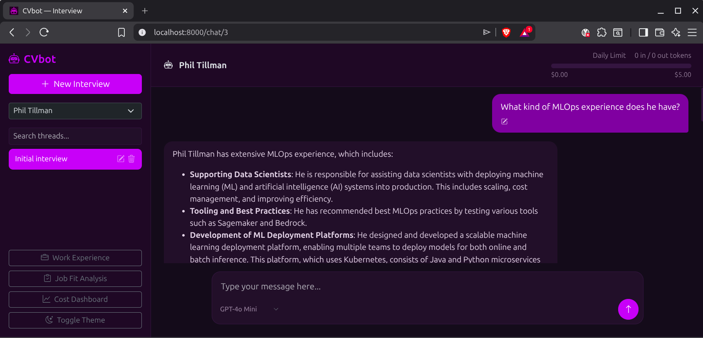
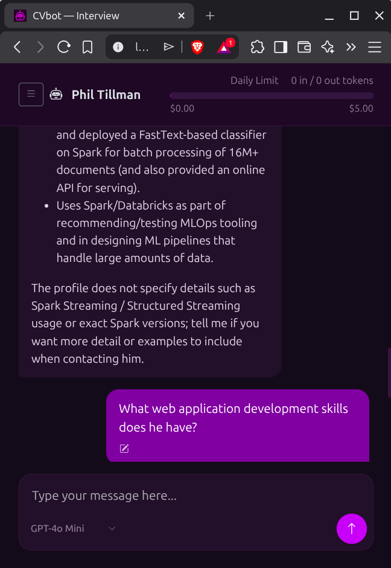
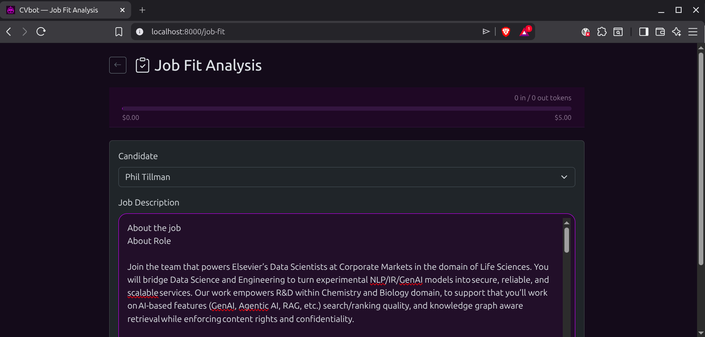
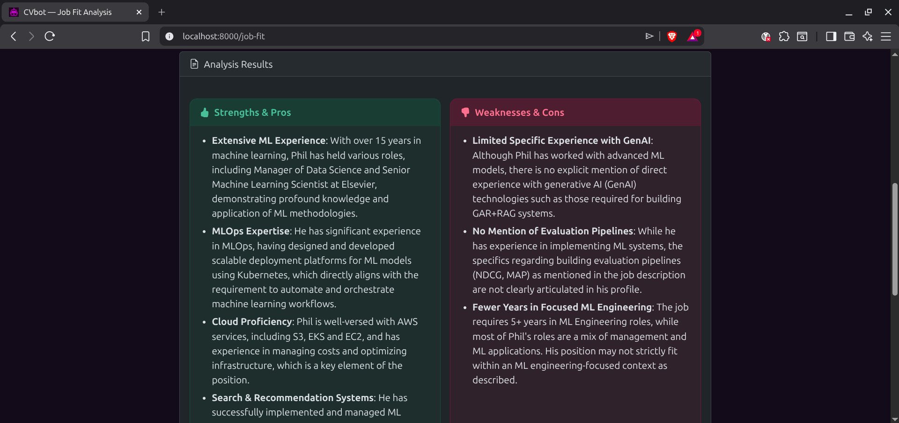
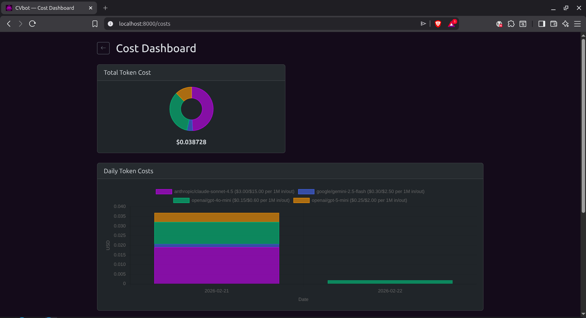
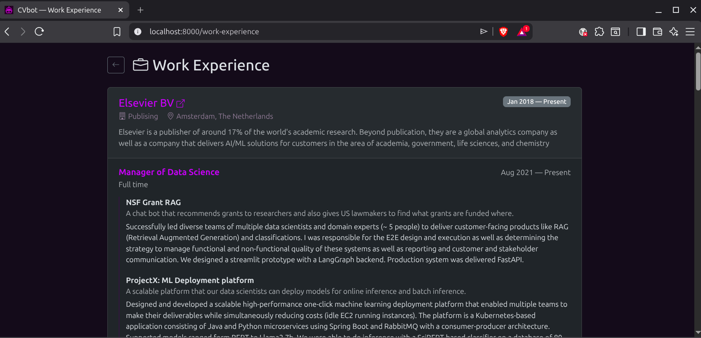

# CVbot

CVbot is a web application where a hiring manager can "interview" with the work experience of a specific candidate via an LLM.

## Why yet another chatbot?
Tired of getting CV's that all look great but then you interview the candidate and it is clear that they do not know the things on their CV? The rise of AI assistance means that everyone's CV looks like a great candidate. The function of a CV as an effective filter of candidates is over. So what now?

First, let's look at some basic ideas about CV's. In the th pre-AI era CV's needed to brief and would not have all the details of what they did. Of course they don't because no one could read a ten page CV for hundreds of candidates. However, now with AI, we as the hiring party can do that heavy-lifting. But what's the advantage then? First of all, all of their experience in gory detail is there. If someone, puts 'Kubernetes' on their old CV, we have no idea about what type of experience they have with it, but if the candidate clearly described what they did, then the information is there. The problem now is how do we, as hiring managers, surface these skills from a candidate, i.e. the needle in the haystack problem? The answer is an LLM, like GPT. Using the "ten page CV" as a data source, you can chat with a candidates work experience. Now you can "interview" a candidate's work experience and surface the relevant information of a candidate easily with the right questions.

With AI, there are even more possibilities. For example, the AI can make a judgement of whether the candidate is a good match for the job with our [job fit](#job-fit-analysis-tool) tool. By pasting the job description text into the tool, you can see the pros and cons of the candidate. For both candidates and hiring managers, this can inform us of whether or not the candidate is right for the job. The idea is that tool should be brutally honest.

## Tech Stack

- **Backend**: FastAPI, Jinja2, SQLite (aiosqlite), httpx
- **Frontend**: Bootstrap 5, vanilla JavaScript, marked.js, Chart.js
- **LLM**: OpenRouter.ai (streaming via SSE)

## Setup

```bash
# Clone and enter the project
cd cvbot

# Install dependencies
uv sync

# Configure environment and app config
# Create/edit secrets/.env and set:
# - ENV=dev
# - OPENROUTER_API_KEY=...
# Then adjust config/config-dev.yaml if needed

# Add candidate JSON files to data/candidates/
# (see plans/CVbot prompt.md for the JSON schema)

# Run the server
uv run uvicorn app.main:app --reload --port 8000
```

Open http://localhost:8000 in your browser.

## Features

### Interview with candidate experience
Select a candidate and ask questions about their work history, skills, education


### Streaming responses
Real-time token-by-token LLM output via Server-Sent Events
    
### Mobile view
Mobile optimized with bootstrap

    
### Light/Dark theme
Auto-detects system preference, with manual toggle
### Job fit analysis tool
Paste a job description and get a structured fit assessment with overall verdict, plus side-by-side strengths/pros and weaknesses/cons cards




### Cost dashboard
Track LLM usage with daily cumulative line chart and monthly bar chart


### Multiple models
Choose from GPT-4o, Claude, Gemini via OpenRouter
### View work experience
View the source data.


## Project Structure

```
app/
├── main.py              # FastAPI app entry point
├── config.py            # Settings (env vars)
├── database.py          # SQLite schema & helpers
├── models.py            # Pydantic models
├── routers/             # API routes (chat, conversations, candidates, costs, job_fit)
├── services/            # Business logic (LLM client, candidate loader, cost tracker)
├── templates/           # Jinja2 HTML templates
└── static/              # CSS and JavaScript
data/candidates/         # Candidate JSON profiles
```
