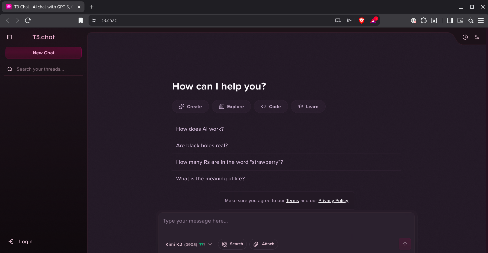

# CVbot

Your task is to create the web application CVbot which is an application where a hiring manager can chat with the work experience of a specific candidate.

## Tech stack
- A web application using FastAPI, Jinja2 for the backend and Bootstrap and vanilla Javascript on the frontend.
- The databse is SQLite.
- LLM integration via openrouter.ai
- Use uv for python package management. DO NOT USE pip!

## Look and feel
- Modern and sleek like T3chat
    
- Light and Dark mode depending on your system.
- Responsive
- Streaming responses.

## Work experience format
```json
{
    "summary": "I am a Machine Learning Scientist and Engineer having over 15 years of experience",
    "skills": "Main languages: Python, Java, Javascript, C#, CSS, HTML, SQL",
    "work": [
        {
            "start": {
                "year": 2018,
                "month": 1
            },
            "end": {
                "present": true
            },
            "employer": {
                "name": "Elsevier BV",
                "description": "Elsevier is a publisher of around 17% of the world's academic research. Beyond publication, they are a global analytics company as well as a company that delivers AI/ML solutions for customers in the area of academia, government, life sciences, and chemistry",
                "link": "https://www.elsevier.com/",
                "sector": "Publising",
                "location": "Amsterdam, The Netherlands"
            },
            
            "roles": [
                {
                    "start": {
                        "year": 2021,
                        "month": 8
                    },
                    "end": {
                        "present": true
                    },
                    "title": "Manager of Data Science",
                    "employment_type": "Full time",
                    "items": [
                        {
                            "title": "NSF Grant RAG",
                            "description": "A chat bot that recommends grants to researchers and also gives US lawmakers to find what grants are funded where.",
                            "contribution": "Successfully led diverse teams of multiple data scientists and domain experts (~ 5 people) to deliver customer-facing products like RAG (Retrieval Augmented Generation) and classifications. I was responsible for the E2E design and execution as well as determining the strategy to manage functional and non-functional quality of these systems as well as reporting and customer and stakeholder communication. We designed a streamlit prototype with a LangGraph backend. Production system was delivered FastAPI."
                        },
                        {
                            "title": "ProjectX: ML Deployment platform",
                            "description": "A scalable platform that our data scientists can deploy models for online inference and batch inference.",
                            "contribution": "Designed and developed a scalable high-performance one-click machine learning deployment platform that enabled multiple teams to make their deliverables while simultaneously reducing costs (idle EC2 running instances). The platform is a Kubernetes-based application consisting of Java and Python microservices using Spring Boot and RabbitMQ with a consumer-producer architecture. Supported models ranged form BERT to Llama2 7b. We were able to do inference with a SciBERT-based classifier on a database of 80 million title-abstracts in 16.5 hours using 20 simultaneous gpu-enabled classifiers. I was the lead architect, developer and machine learning expert on the project composed of myself, a machine learning engineer and a data scientist."
                        }
                    ]
                },
                {
                    "start": {
                        "year": 2020,
                        "month": 4
                    },
                    "end": {
                        "year": 2024,
                        "month": 9
                    },
                    "title": "Industry Lab Manager - ICAI Discovery Lab",
                    "employment_type": "Part time",
                    "items": [
                        {
                            "title": "Industry Lab Manager",
                            "description": "The Discovery Lab is a ICAI lab that conducts research that is a partnership between the University of Amsterdam, the Free University of Amsterdam, Elsevier. The lab consisted of 4 Work Packages conducted by 3 PhD students and 2 Post Doctoral resaerchers.",
                            "contribution": "I am responsible for the alignment of the Elsevier's strategic business activities and the lab's research activities.\n\nThe Discovery Lab is a collaboration between the Vrije Universiteit of Amsterdam and the University of Amsterdam focused on machine learning and artificial intelligence. \n\nhttps://discoverylab.ai/"
                        }
                    ]
                },
                {
                    "start": {
                        "year": 2019,
                        "month": 6
                    },
                    "end": {
                        "year": 2021,
                        "month": 8
                    },
                    "title": "Senior Machine Learning Scientist",
                    "employment_type": "Full time",
                    "items": [
                        {
                            "title": "OmniScience classification update",
                            "description": "OmniScience classification is a service, re-used by many applications, that classified text (like abstracts) into classes like 'galactic astrophysics' or 'micro-biology'. This is used at scale on 16M+ documents in Science Direct.",
                            "contribution": "Updated this core classifier with FastText-BERT ensemble model."
                        }
                    ]
                }
            ]
        }
    ],
    "education": [
        {
            "start": {
                "year": 2000,
                "month": 9
            },
            "end": {
                "year": 2007,
                "month": 6
            },
            "degree": "PhD",
            "institution": "University of Pittsburgh",
            "subjects": [
                "Physics"
            ],
            "notes": "",
            "completed": true,
            "dissertation": {
                "title": "Deformation Quantization and the Fedosov Star-Product on Constant Curvature Manifolds of Codimension One",
                "description": "my description",
                "advisors": ["George Sparling", "E. Ted Newman"],
                "primary_research": "Quantum Mechanics/Quantum Field Theory on Curved Space-Times"
            }
        },
        {
            "start": {
                "year": 1995,
                "month": 9
            },
            "end": {
                "year": 2000,
                "month": 6
            },
            "degree": "BS",
            "institution": "University of Pittsburgh",
            "subjects": [
                "Physics and Astronomy",
                "Mathematics"
            ],
            "GPA": "3.8",
            "notes": "",
            "completed": true
        }
    ],
    "publications": [
        {
            "title": "",
            "abstract": "",
            "date": {
                "year": 2025,
                "month": 1,
                "day": 23
            },
            "journal": "",
            "doi": "",
            "links": [
                "link1",
                "link2"
            ]
        }
    ]
}
```


## Cost Tracker Feature
- Built LLM requests cost tracker. This tracks the number of tokens to which LLM computing the costs and storing each request timestamp, nr_input_tokens, nr_output_tokens, model_id. Based on this you will make charts tracking cumalative daily costs (line graph) and cumaltive monthly costs (bar chart).